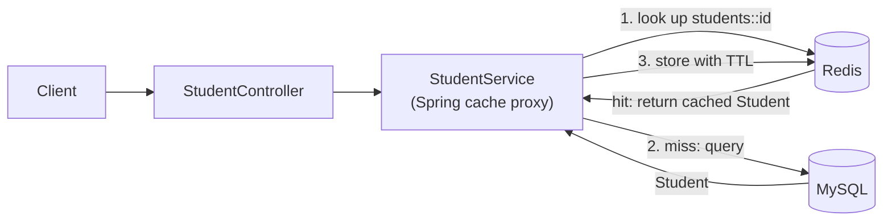

# Redis-Backed-Student-REST-API
Redis Cached Student REST API built with Spring Boot, and MySQL for efficient data access.

A Spring Boot REST API that places a Redis cache in front of MySQL using the **cache-aside** pattern. Reads are served from Redis when the entry exists and fall back to the database on a miss; writes refresh the cache.

I built this to understand caching hands-on rather than from diagrams: how cache names and keys map to Redis keys, how TTL bounds staleness, why serialization matters, and how to *prove* a request was served from the cache and not the database.

## Tech stack

| Area | Technology |
|---|---|
| Language / framework | Java 21, Spring Boot 4.1.1 (Spring MVC) |
| Persistence | Spring Data JPA, Hibernate, MySQL |
| Cache | Redis via Spring Cache abstraction (`@EnableCaching`, `RedisCacheManager`) |
| Validation | Jakarta Bean Validation |
| API docs | springdoc-openapi (Swagger UI) |
| Infrastructure | Docker Compose (MySQL + Redis) |
| Tooling | Maven, Lombok |

## How it works



| Endpoint | Cache annotation | Effect |
|---|---|---|
| `GET /students/{id}` | `@Cacheable(value = "students", key = "#id")` | **Hit:** method body is skipped, MySQL is not touched. **Miss:** queries MySQL, then stores the result in Redis. |
| `POST /students` | `@CachePut(value = "students", key = "#result.id")` | Saves to MySQL and writes the new student to Redis immediately, so the first read after a write is already a hit. |

The cache name and key form the Redis key: `students::<id>`.

## API

| Method | Path | Description | Success | Errors |
|---|---|---|---|---|
| `POST` | `/students` | Create a student | `200` with the saved student (including generated `id`) | `400` for invalid input |
| `GET` | `/students/{id}` | Get a student by id (cached) | `200` with the student | `404` if not found |

Example:

```bash
curl -X POST http://localhost:8080/students \
  -H "Content-Type: application/json" \
  -d '{"name": "Alex", "age": 32}'
```

```json
{ "id": 1, "name": "Alex", "age": 32 }
```

The `id` is generated by the database, so do not send it in the request body.

Interactive docs: `http://localhost:8080/swagger-ui/index.html`

## Running locally

**Prerequisites:** JDK 21, Docker.

```bash
# 1. Start MySQL and Redis
docker compose up -d

# 2. Start the application (or run RediscachedapiApplication from your IDE)
./mvnw spring-boot:run          # Windows: mvnw.cmd spring-boot:run
```

Cache settings in `src/main/resources/application.properties`:

```properties
spring.cache.type=redis
spring.data.redis.host=localhost
spring.data.redis.port=6379
spring.cache.redis.time-to-live=10m
```

The credentials in `docker-compose.yml` are for local development only.

## Verifying that the cache works

The service only logs `Fetching from MySQL for id N` when the method body runs, which only happens on a cache miss. Combined with Redis's own tooling, you can check each step:

1. **Create a student** with `POST /students`, then inspect Redis:
   ```bash
   docker exec -it redis-container redis-cli
   KEYS *            # expect: students::1
   TTL students::1   # counts down from ~600 seconds
   ```
2. **Repeat `GET /students/1`.** The application console shows no `Fetching from MySQL` line and no Hibernate `select`, so the response came from Redis.
3. **Force a miss** by deleting the entry:
   ```bash
   DEL students::1
   ```
   The next `GET /students/1` logs `Fetching from MySQL` plus the `select` statement, and `KEYS *` shows `students::1` again. Further calls are quiet again.
4. **Watch live traffic** with `MONITOR` in redis-cli to see the `GET` and `SET` commands as requests arrive.

## Project structure

```
src/main/java/com/riya/rediscachedapi
├── RediscachedapiApplication.java   # @SpringBootApplication, @EnableCaching
├── controller/StudentController.java
├── service/StudentService.java      # @Cacheable / @CachePut live here
├── repository/StudentRepository.java  # Spring Data JPA
└── entity/Student.java              # JPA entity, Serializable for Redis
```

## Design decisions and trade-offs

- **Declarative cache-aside.** Spring's cache abstraction keeps Redis code out of the business logic. The trade-off is less control on a miss, and calls from one method to another inside the same class bypass the cache proxy.
- **One entry per student id.** Cache name `students` plus key `#id` gives predictable Redis keys and simple invalidation.
- **TTL of 10 minutes (configurable).** The TTL puts an upper bound on how stale a cached student can be. The right value depends on how much staleness the data can tolerate.
- **Failed lookups are not cached.** A missing student throws a 404 from inside the cached method, so nothing is stored and a student created later is found normally.
- **`@CachePut` on create.** Avoids a guaranteed cache miss on the first read after a write.
- **JDK serialization for cached values.** This is Spring's default, so `Student` implements `Serializable`. The trade-off: values are binary and unreadable in `redis-cli`, and they are sensitive to class changes. JSON serialization is on the roadmap.
- **Stale data on out-of-band changes.** A row changed directly in MySQL is not visible through the API until the entry expires or is evicted.

## Things I ran into while building it

- **Spring Boot 4 needs `spring-boot-starter-cache` on the classpath.** With only the Redis starter, `@EnableCaching` fails at startup with `No qualifying bean of type 'CacheManager'`.
- **Every cache annotation needs a cache name.** A bare `@Cacheable` fails at runtime with `No cache could be resolved ... At least one cache should be provided`.
- **`@Id` must come from `jakarta.persistence`.** The Spring Data `@Id` is ignored by Hibernate, which then reports the entity as having no identifier.
- **Extra methods in a Spring Data repository are parsed as queries.** A method like `saveStudent(...)` fails at startup, because only derived-query names (`findByName`) or `@Query` methods are valid. `save()` and `findById()` are already inherited from `JpaRepository`.

## Roadmap

Planned, not yet implemented:

- [ ] JSON serialization for cached values
- [ ] Redis-based rate limiter
- [ ] Unit tests (Mockito) and integration tests with Testcontainers that assert cache hits
- [ ] Cache hit/miss metrics via Actuator and Micrometer
- [ ] Containerize the application in `docker-compose.yml`

## Author

**Riya Sharma** · [GitHub](https://github.com/Riya2309ai) · [LinkedIn](https://linkedin.com/in/riya-sharma-2a4b0713b)
